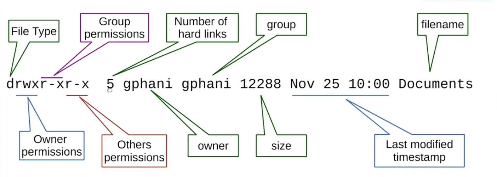
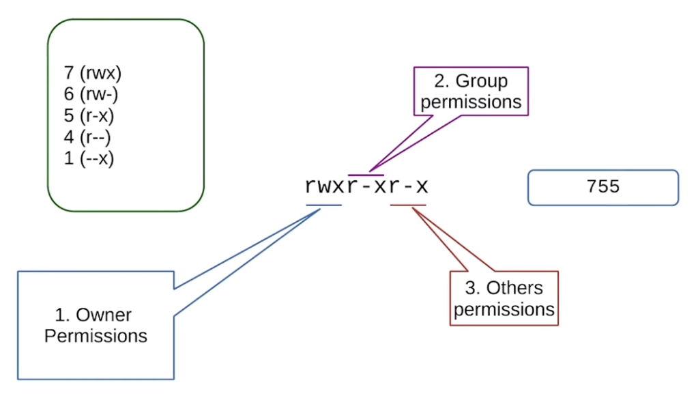

- To see current time stamp
    ```bash
    date
    ```
- To see the calander of current month
    ```bash
    cal     # to see calander of specific month cal Dec 2002
    ```
- To see the calander in different orientiation
    ```bash
    ncal
    ```
- To see the amount of memory free right now in the system
    ```bash
    free        # To make numbers human readable use cmd free -h
    ```
- To see what groups current user belongs to
    ```bash
    groups
    ```
### Typical output of ls -l
<p align="center">
  
</p>

### File type
- "-"      : Regular file
- "d"      : Directory
- "l"      : Symbolic link
- "c"      : Character file
- "b"      : Block file
- "s"      : Socket file
- "p"      : Named pipe

- inode is an entry in the filesystem table about the location in storage media and it'll be unique for every file. If multiple files have same inode then those are hard link

### Permission string 
- r     : read
- w     : write
- x     : execurable or if it's directory so it can be changed
<p align="center">
  
</p>

- To create directory
    ```bash
    mkdir dir_name
    ```